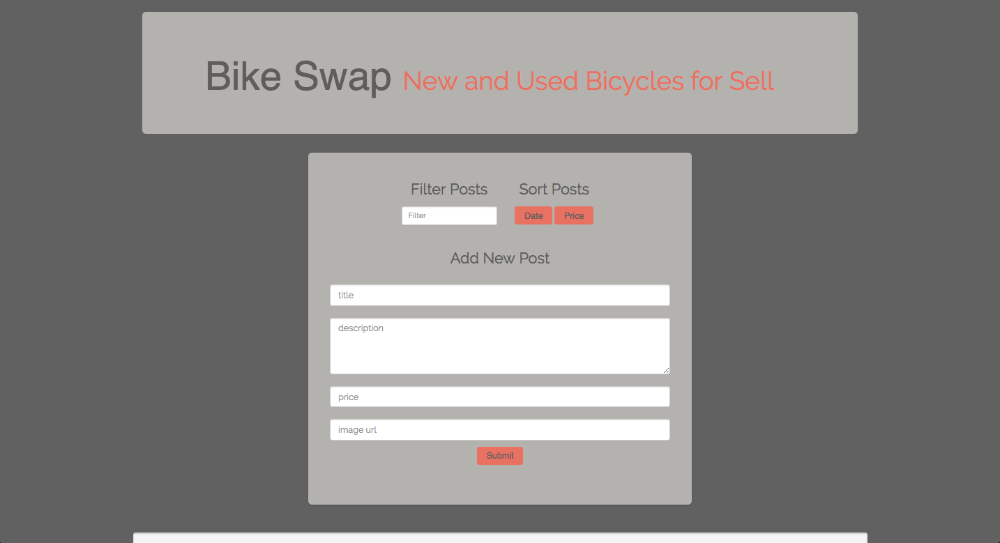

Welcome to Bike Swap!

 

gSchool project - Galvanize Classified - Part 3

Project Description

Now is your time to show off and make your Angular app pretty.

Getting Started

Copy your files from Part 2 into your project directory. This is important: make sure you don't edit the part 2 files so we can evaluate each part independently. This also allows you to redo pieces of this assessment individually.

Requirements

The app should implement the following:

Valid, well-implemented HTML and CSS

Readable and logical JavaScript

Responsiveness for different screen sizes and orientations

A logical and intuitive UI

Tips

Simplicity is the ultimate sophistication.

— Leonardo da Vinci 

Everything should be made as simple as possible, but no simpler.

— Albert Einstein

"Picasso had a saying -- 'good artists copy; great artists steal' -- and we have always been shameless about stealing great ideas."

— Steve Jobs
